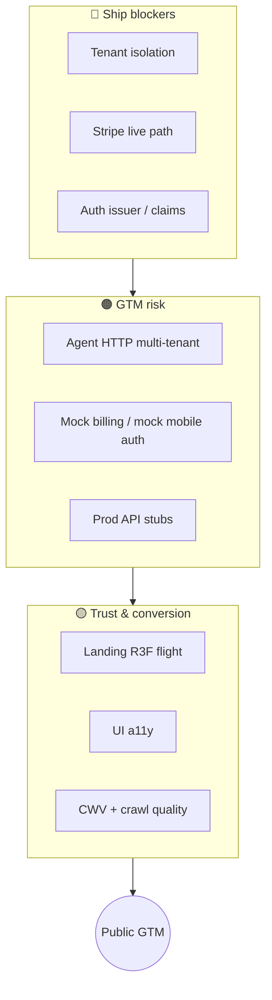
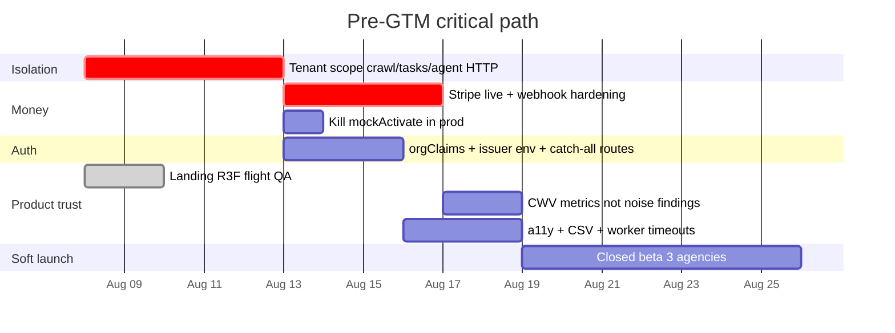
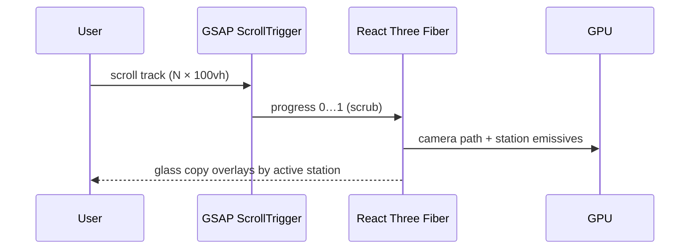

# Pre-GTM readiness — Mission Control OS

> **Stack tip companion.** This is the single source of truth for what must be true before we invite real agencies. It merges prior CodeRabbit/Codex findings with **synthetic CodeRabbit-style reviews** of rate-limited PRs (#39–#41, #44–#46).

---

## Executive picture

| Gate | Meaning | Status |
|------|---------|--------|
| **Hard block** | Cross-tenant data write/read possible | Must fix before any paid customer |
| **Billing block** | Money path can desync or be spoofed | Must fix before paid plans |
| **Trust** | Landing, a11y, audit depth | Blocks conversion, not data safety |
| **Later** | Mobile Clerk live, INP, multi-repo | Post-GTM OK as scaffold |

---

## 1. What this document is (and is not)

| Includes | Excludes |
|----------|----------|
| CodeRabbit **line** findings from PRs that reviewed (#21, #22, #32, #36, #40, #42, #43) | Invented work from rate-limit *messages* alone |
| **Synthetic CR-style reviews** of #39, #41, #44, #45, #46 using the same severity taxonomy | freview (not present on repo comments) |
| Minor / trivial / “quick win” items when they affect GTM trust | Vercel preview noise |
| Cross-cutting epics for go-to-market | Full multi-repo split (ADR-0017 deferred) |

**CodeRabbit methodology applied to unreviewed PRs**

1. Severity tags: 🔴 Critical · 🟠 Major · 🟡 Minor · 🔵 Trivial  
2. Category: Security, Data integrity, Maintainability, Performance, a11y  
3. Statement of **impact** if unfixed  
4. Concrete file locus + minimal fix direction  
5. Agent-ready action line  

---

## 2. Rate-limited PR reviews (synthetic, CodeRabbit style)

### PR #44 — Mobile Clerk auth shells

🔴 Critical · Security · Mock auth is a production identity path

**File:** `apps/android/.../AuthViewModel.kt`, `apps/ios/.../SignInShellView.swift`

Mock Agency Admin / Client Portal buttons are always available. If a release build ships before ClerkKit is linked, anyone can “sign in” as admin with no server validation.

**Fix:** Gate mock behind `DEBUG` / `BuildConfig.DEBUG` / `#if DEBUG`. Never show mock when `CLERK_PUBLISHABLE_KEY` is set in release.

🟠 Major · Reliability · AuthViewModel scope leak

**File:** `AuthViewModel.kt`

`CoroutineScope(Dispatchers.Main.immediate)` without `SupervisorJob` or lifecycle cancel — work can outlive the activity.

**Fix:** `viewModelScope` once AndroidX lifecycle is on the classpath, or `MainScope()` + `onCleared` cancel.

🟡 Minor · a11y · Portal vs Agency messaging

Module placeholders still imply Agency org session for Portal modules. Use surface-specific copy (ADR-0026).

### PR #45 — Site structure graph

🟠 Major · Data integrity · Unbounded structure payload

**File:** `apps/web/convex/crawl.ts` `structureValidator`, `jobs.completeInternal`

Agent can post huge `nodes`/`edges` arrays; Convex accepts without length caps → storage / query DoS.

**Fix:** `v.array(...).maxLength(n)` style validation (or manual `.length` checks ≤ 200 / 500 matching agent caps). Reject oversize with 400.

🟠 Major · Correctness · Truncate leaves orphan edges

**File:** `apps/agent/src/crawl.rs`

`nodes.truncate(200)` after edges are built can leave edges pointing at removed node ids; UI draws incomplete graph.

**Fix:** Truncate nodes first (prefer shallow depths), then filter edges to surviving ids.

🟡 Minor · Maintainability · No lifecycle for `siteStructures`

No cleanup when runs deleted; table grows forever.

**Fix:** Delete structure on run purge or cap N latest per site.

### PR #46 — Playwright CWV

🔴 Critical · Reliability · UTF-8 head slice panic

**File:** `apps/agent/src/crawl.rs` `count_render_blocking_scripts_in_head`

`lower[..50_000]` is not guaranteed a char boundary → panic mid-crawl on non-ASCII HTML.

**Status on tip:** fixed in this PR (char_indices cap).

🟠 Major · Product · CWV noise as findings

Every page emits `cwv_snapshot` as an audit finding → drowns prioritisation / fix-next.

**Fix:** Store metrics on snapshot table or metrics JSON; only emit threshold breaches as findings.

🟠 Major · Security · Agent complete trusts structure + metrics blindly

Shared `MC_AGENT_SECRET` can complete any `crawlRunId` and attach structure for any tenant.

**Fix:** Bind agent tokens to `agencyId`; reject complete for foreign runs (ties to tenant epic).

🟡 Minor · Flake · `waitForTimeout` in CWV script

Replace with networkidle + PerformanceObserver settle condition.

### PR #41 — Prior scroll-world landing (superseded)

🟠 Major · Product · Marketing quality

Diorama JPG scrub player read as a media widget, not a product. Large static assets, weak motion language vs modern-design-playground / invite / michaelhurley.

**Status on tip:** diorama assets + `scroll-world.tsx` **deleted**. Replaced with R3F + GSAP scroll flight (`WorldStage`).

### PR #39 — Jobs UI / portal sparklines (no CR lines)

🟠 Major · Security · Bulk share findings

Confirm bulk share paths re-check client grant + agency ownership (same tenant pattern as crawl).

🟡 Minor · UX · Portal sparklines empty vs loading

Distinguish `undefined` query from empty array (same pattern as portal CRM contacts).

---

## 3. Prior stack findings (still required)

### 🔴 Hard blockers

| ID | Item | Locus | Origin |
|----|------|-------|--------|
| **R01–R02** | Agency-scope `streamFinding` / `completeRun` / `findingsForRun` | `convex/crawl.ts` | #21 |
| **R04–R05** | Workspace-scope task update / promote | `convex/tasks.ts` | #22 |
| **R44-mock** | Mobile mock auth DEBUG-only | iOS/Android auth | #44 synth |
| **R46-agent** | Agent HTTP tenant binding | `convex/http.ts` + agent tokens | #42/#46 |

### 🟠 Billing & production

| ID | Item | Locus |
|----|------|-------|
| **B1** | Block `mockActivate` when `STRIPE_SECRET_KEY` present / non-dev | `billing.ts` |
| **B2** | Admin-only `createPortalSession` | `billing.ts` |
| **B3** | Reject out-of-order Stripe events | webhook + `event.id` store |
| **B4** | Accept all `v1` signatures in header | `stripeWebhook.ts` |
| **B5** | Cancel via Stripe API before local cancel | `cancelMine` |
| **P1** | No Vite dual-write CRM stubs in production serverless | `api/[...path].ts` |
| **P2** | Serialize + pin production deploy workflow | `.github/workflows` |

### 🟠 Auth consistency

| ID | Item |
|----|------|
| **A1** | Single `orgClaims` / `requireAgency` helper everywhere |
| **A2** | Clerk issuer from env per Convex deployment |
| **A3** | Catch-all Clerk path routes for sign-in/up |

### 🟡 Trust, crawl, UI

| Theme | Examples |
|-------|----------|
| CSV formula injection | `export-csv.ts` neutralize `=+@-` |
| Trigger worker | poll timeout, no overlap, validate interval |
| Desktop Effect | `catchAll` on tryPromise, fetch timeouts, honest `stopOk` |
| Schedules | use `by_next` index |
| HTML extractors | real meta parsing, favicon quotes, strip_tags |
| a11y | focus rings, progress labels, Sheet/Tooltip primitives |
| Structure payload | max length + edge filter after truncate |

Full checkbox inventory of original line comments remains in historical form under [§5](#5-full-checkbox-inventory-r-series).

---

## 4. Pre-GTM sequencing (recommended)

**Definition of GTM-ready**

1. No cross-tenant mutation paths remain (tests for foreign `crawlRunId` / task id → deny).  
2. Stripe Checkout + webhook verified in test mode; mock activate disabled with live keys.  
3. Clerk prod issuer matches Convex prod.  
4. Landing loads & scrolls on desktop + mobile reduced-motion.  
5. Agent complete requires agency-scoped credential.  
6. Pricing page / Settings billing honest about trial vs paid.

---

## 5. Full checkbox inventory (R-series)

Work top-down. Verify still valid on tip before coding.

### P0 / Critical

- [x] **R01–R02** Agency-scope crawl mutations — already on tip via `assertRunInAgency`
- [x] **R03** UTF-8 head slice panic — fixed
- [x] **R04–R05** Workspace-scope task update/promote — already on tip
- [x] **R44a** DEBUG-only mock mobile auth — iOS `#if DEBUG` · Android BuildConfig.DEBUG
- [x] **R46a** Tenant-bind agent HTTP via `agencyId` / `X-MC-Agency-Id` on claim/stream/complete

### P1 / Major (selected)

- [x] **R10** `requireAgency` helper + `orgClaims` single path  
- [x] **R11** Clerk issuer from `CLERK_JWT_ISSUER_DOMAIN`  
- [ ] **R12** Portal grants index / no full scan — still open (schema index add next)  
- [x] **B1–B5** mockActivate blocked; portal admin; multi-v1 sig; event idempotency; cancelViaStripe  
- [x] **P1–P2** Prod dual-write 501; deploy concurrency + pinned bun/vercel  
- [x] **TW1** Trigger poll timeout / no overlap / interval validation  
- [x] **DE1** Desktop Effect fetch timeouts + honest stopOk + catchAll  
- [x] **SC1** Schedules `by_next` index for tickDue  
- [x] **ST1** Structure max 200/500 + edge filter after truncate  
- [x] **CW1** CWV snapshot noise removed (thresholds only)  
- [x] **CSV1** Formula injection neutralize  

### P2 / Minor

- [x] Onboarding step bounds (already), progress aria-label, portal loading, clerk appearance shared, social category union, multi-v1 Stripe, handoff note persist, handoff status reject  
- [ ] Table dividers / remaining a11y nits — optional polish

---

## 6. Landing rebuild (this stack PR)

| Removed | Added |
|---------|--------|
| `public/diorama/scene_*.jpg` | — |
| `components/mc/scroll-world.tsx` (CSS zoom scrub) | `components/landing/world-stage.tsx` |
| Media-player mental model | **R3F + GSAP ScrollTrigger** continuous camera flight |

Design lineage: **modern-design-playground** Stage (cosmic field, scroll-linked camera), **michaelhurley** PortfolioScroll (pin + scrub), **invite** depth parallax energy — implemented as abstract Mission Control stations (cockpit → scanner → CRM → surfaces → portal), not stock diorama plates.

---

## 7. Explicitly out of pre-GTM scope

- Live ClerkKit / clerk-android (shells OK)  
- Full Lighthouse INP  
- iCloud logo vector import  
- ADR-0017 multi-repo split  
- freview (not integrated — wire separately if desired)

---

*Last updated: 2026-08-08 · Branch: `stack/27-pre-gtm-landing-r3f`*
